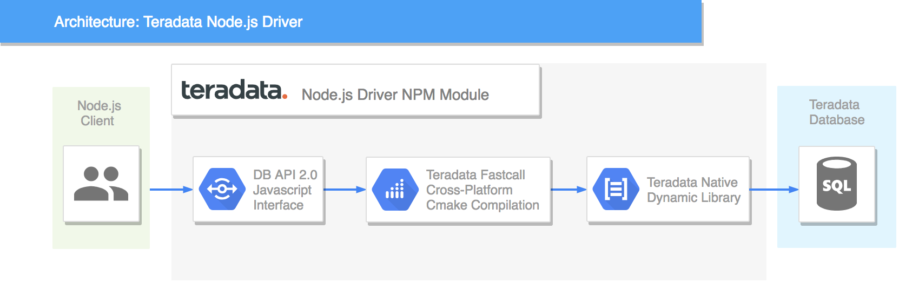

## Node.js Driver for Teradata

[](https://travis-ci.org/Teradata/nodejs-driver)

<a href="https://scan.coverity.com/projects/teradata-nodejs-driver">
  
</a>

<p>
    &nbsp;&nbsp;&nbsp;&nbsp;&nbsp;&nbsp;&nbsp;&nbsp;&nbsp;&nbsp;
    
</p>

The Teradata nodejs-driver module is a Database API Specification v2.0 compliant driver for Node.js and the Teradata Database.

Teradata nodejs-driver is open source and maintained by Teradata. It is currently in RC but has a comprehensive test suite for the supported features.

Database API Specification v2.0: https://www.python.org/dev/peps/pep-0249/

---

## Supported Platforms

> :information_source: Node.js versions 14 and 16 are not supported. There is an issue in Node.js that affects `node-ffi-napi` library that this driver depends on: https://github.com/node-ffi-napi/ref-napi/issues/54. Newer versions of Node.js no longer have the issue. 


For Node.js 8.x, 9.x, 10.x, 11.x use:
```
"dependencies": {
  "teradata-nodejs-driver": "1.0.0-beta.2"
}
```

For Node.js 12.x, 17.x:
```
"dependencies": {
  "teradata-nodejs-driver": "1.0.0-rc.15"
}
```

Operating Systems:

* Apple macOS, Microsoft Windows, Linux

---

## Architecture


---

## Useful Information

* [Setup](docs/SETUPRUNNING.md)
* [Connection Parameters](docs/CONNECTIONPARAMS.md)
* [Stored Password Protection](docs/STOREDPASSWORD.md)
* [Data Types](docs/DATATYPES.md)
* [Module Exceptions](docs/MODULEEXCEPTIONS.md)
* [Tests](docs/RUNNINGTESTS.md)
* [Examples](examples/README.md)

---

## License

The MIT License

Copyright (c) 2022 by Teradata. All rights reserved. http://teradata.com

Permission is hereby granted, free of charge, to any person obtaining a copy
of this software and associated documentation files (the "Software"), to deal
in the Software without restriction, including without limitation the rights
to use, copy, modify, merge, publish, distribute, sublicense, and/or sell
copies of the Software, and to permit persons to whom the Software is
furnished to do so, subject to the following conditions:

The above copyright notice and this permission notice shall be included in
all copies or substantial portions of the Software.

THE SOFTWARE IS PROVIDED "AS IS", WITHOUT WARRANTY OF ANY KIND, EXPRESS OR
IMPLIED, INCLUDING BUT NOT LIMITED TO THE WARRANTIES OF MERCHANTABILITY,
FITNESS FOR A PARTICULAR PURPOSE AND NONINFRINGEMENT. IN NO EVENT SHALL THE
AUTHORS OR COPYRIGHT HOLDERS BE LIABLE FOR ANY CLAIM, DAMAGES OR OTHER
LIABILITY, WHETHER IN AN ACTION OF CONTRACT, TORT OR OTHERWISE, ARISING FROM,
OUT OF OR IN CONNECTION WITH THE SOFTWARE OR THE USE OR OTHER DEALINGS IN
THE SOFTWARE.

---
